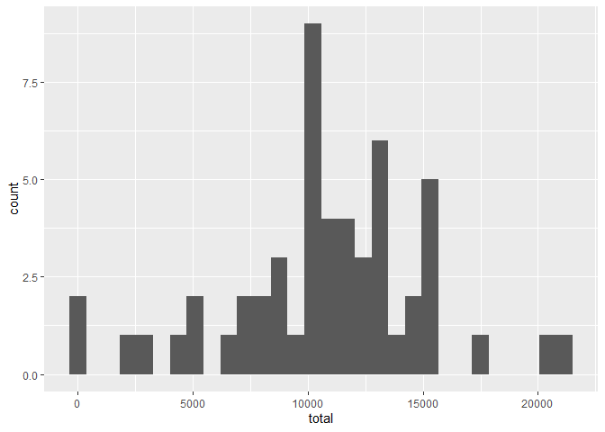
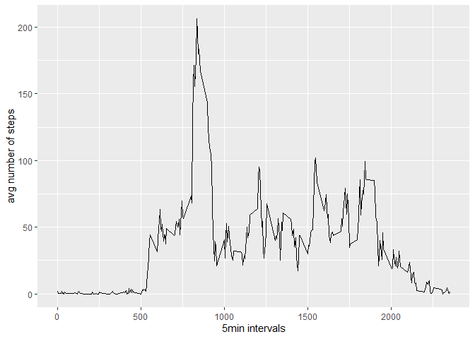
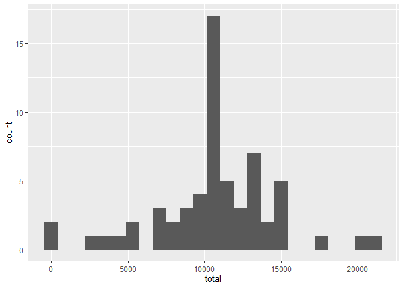
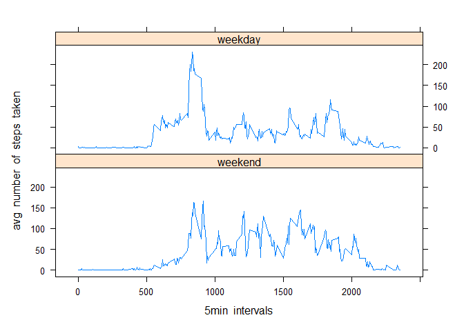

First, we load and process the data and the necessary libraries.

```r
library(dplyr)
library(ggplot2)
library(lattice)
```

## Loading and preprocessing the data

```r
dt <-read.csv("./activity/activity.csv")
```


## What is mean total number of steps taken per day?
1. Calculate the total number of steps taken per day?

```r
proc_data <- dt %>%
        group_by(date) %>%
        summarise(total = sum(steps))
proc_data
```

```
## # A tibble: 61 x 2
##    date       total
##    <fct>      <int>
##  1 2012-10-01    NA
##  2 2012-10-02   126
##  3 2012-10-03 11352
##  4 2012-10-04 12116
##  5 2012-10-05 13294
##  6 2012-10-06 15420
##  7 2012-10-07 11015
##  8 2012-10-08    NA
##  9 2012-10-09 12811
## 10 2012-10-10  9900
## # ... with 51 more rows
```

2. Make a histogram of the total number of steps taken each day

```r
hist_steps <- ggplot(proc_data, aes(total)) + 
        geom_histogram()
hist_steps
```

<!-- -->

3. Calculate the mean and the median of the total number of steps taken per day

```r
mean_and_median <- proc_data %>%
        summarise(mean = mean(total, na.rm = TRUE), 
                  median=median(total, na.rm = TRUE))
cat("mean:  ", mean_and_median$mean, "\n", "median:  ", mean_and_median$median)
```

```
## mean:   10766.19 
##  median:   10765
```


## What is the average daily activity pattern?

1. Make a time series plot of the 5min intervals and the avg number of steps taken.

```r
steps_per_interv <- dt %>%
        group_by(interval) %>%
        summarise(average=mean(steps, na.rm=TRUE))

steps_plot <- ggplot(steps_per_interv, aes(x=interval, y=average)) +
        geom_line() +
        xlab("5min intervals") +
        ylab("avg number of steps") + 
        theme_grey()
steps_plot
```

<!-- -->

2. Which interval contains the maximum number of steps?

```r
steps_per_interv$interval[steps_per_interv$average == max(steps_per_interv$average)]
```

```
## [1] 835
```

## Imputing missing values

1. The total number of rows with NAs

```r
sum(apply(dt, 1, anyNA))
```

```
## [1] 2304
```

2. Devise a strategy for filling in all of the missing values in the dataset.  
The missing data will be replaced by the rounded value of the mean for that day using the following function::

```r
replaceNa <- function(i){
        if (is.na(i["steps"])){
                temp <- steps_per_interv$average[steps_per_interv$interval==as.numeric(i["interval"])]
                i["steps"]<- round(as.numeric(temp))
        }
        else{
                i["steps"] = as.numeric(i["steps"])
        }
}
```

3. Create a new dataset that is equal to the original but with the missing data filled in.

```r
new_data <- data.frame(dt)
new_data$steps <- apply(new_data, 1, replaceNa)
head(new_data, 5)
```

```
##   steps       date interval
## 1     2 2012-10-01        0
## 2     0 2012-10-01        5
## 3     0 2012-10-01       10
## 4     0 2012-10-01       15
## 5     0 2012-10-01       20
```

4. Make a histogram of the total number of steps taken each day and calculate and report the mean and the median.
- Create a new histogram.

```r
proc_data2 <- new_data %>%
        group_by(date) %>%
        summarise(total = sum(steps))

hist_steps2 <- ggplot(proc_data2, aes(total)) + 
        geom_histogram(bins=25)
hist_steps2
```

<!-- -->

- Recalculate the mean and the median.

```r
mean_and_median2 <- proc_data2 %>%
        summarise(mean = mean(total, na.rm = TRUE), 
                  median=median(total, na.rm = TRUE))
cat("mean:  ", mean_and_median2$mean, "\n", "median:  ", mean_and_median2$median)
```

```
## mean:   10765.64 
##  median:   10762
```


- Do these values differ from the first estimates

```r
mean_and_median2$mean != mean_and_median$mean
```

```
## [1] TRUE
```

```r
mean_and_median2$median != mean_and_median$median
```

```
## [1] TRUE
```

- What is the impact of inputting missing data?  
Replacing the missing data changes the mean and the median of the data.

## Are there differences in activity patterns between weekdays and weekends?

1. Create a factor variable of two levels: "weekend" and "weekday"

```r
new_data <- new_data %>%
        mutate(day = ifelse(weekdays(as.Date(date, "%Y-%m-%d")) %in%
                                 c("Sunday","Saturday"),"weekend","weekday"))
head(new_data, 5)
```

```
##   steps       date interval     day
## 1     2 2012-10-01        0 weekday
## 2     0 2012-10-01        5 weekday
## 3     0 2012-10-01       10 weekday
## 4     0 2012-10-01       15 weekday
## 5     0 2012-10-01       20 weekday
```

2. Make a panel plot containing time series plots of both day factors.

```r
steps_per_interv_per_day <- new_data %>%
        group_by(day, interval) %>%
        summarise(average=mean(steps, na.rm=TRUE))


day.f<-factor(steps_per_interv_per_day$day,levels=c("weekend", "weekday"),
              labels=c("weekend", "weekday"))

attach(steps_per_interv_per_day)

xyplot(average~interval|day.f, type='l', layout=c(1, 2),
       ylab="avg  number  of  steps  taken", xlab="5min  intervals")
```

<!-- -->
